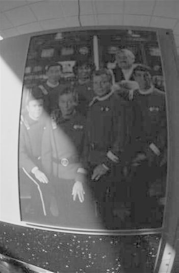

# 数字图像处理作业4
## 邹永浩 2019211168

### 1.DFT
1. 实验环境
	由于希望深入理解相关原理，实验采用`Java`语言，仅使用原生库，无任何第三方组件，这也导致程序效率低，滤波效果较差。
2. 原理与实现
	1. 首先读入图片，获取RGB值，并转换为灰度值，并乘以`(-1)^(x+y)`
		
		```java
		for (int i = 0; i < m; i++) {
			for (int j = 0; j < n; j++) {
				pixel = img.getRGB(i, j);
				int red = pixel & 0x00ff0000 >> 16;
				int green = (pixel & 0x0000ff00) >> 8;
				int blue = (pixel & 0x000000ff);
				gray = (red + green + blue) / 3;
				if ((i + j) % 2 != 0) {
					gray = -gray;
				}
				last[i][j] = gray;
			}
		}
		```
  
		这里有个小问题，转为灰度有不同的标准，此处直接将RGB值求平均，除此外也可以有其他方法，详见[此处](https://en.wikipedia.org/wiki/HSL_and_HSV#Lightness)。(实际上，我也进行了其他方式的实验，结果类似）
	2. 根据DFT的公式进行计算
		
		```java
		for (int u = 0; u < m; u++) {
			for (int v = 0; v < n; v++) 
				next[u][v] = DFT(last, u, v);
			}
		}
		...
		private static Complex DFT(int[][] f, int u, int v) {
			int M = f.length;
			int N = f[0].length;
			Complex c = new Complex(0, 0);
			double u_M = (double) u / (double) M;
			double v_N = (double) v / (double) N;
			for (int x = 0; x < M; x++) {
				for (int y = 0; y < N; y++) {
		Complex temp = new Complex(0, -2 * Math.PI * (x * u_M + y * v_N));
					c = c.plus(temp.exp().times(f[x][y]));
				}
			}
			return c;
		}
		```
		这里没有什么特别的，就是直接根据公式来，`Complex`是一个自定义的复数类，其中定义了一些简单的复数运算。
	3. 但是这样的话有个大问题，就是运算特别慢，慢到在我的`CPU`型号是10年前的机器上算一个图片要几个小时，有一个改进的算法是`FFT`，但是此处我并不想用此方法。那么我们可以将原算式进行并行化计算，故将代码改为如下方式
		```java
		CountDownLatch latch = new CountDownLatch(m * n);
		for (int u = 0; u < m; u++) {
			for (int v = 0; v < n; v++) {
				int finalU = u;
				int finalV = v;
		    	THREAD_POOL_EXECUTOR.submit(() -> {
					next[finalU][finalV] = DFT(last, finalU, finalV);
					latch.countDown();
				});
			}
		}
		latch.await();
		```
		`THREAD_POOL_EXECUTOR`是一个大小为12的线程池，这样的话我们可以把运算时间缩短到20分钟左右。虽然还是很长，但勉强可以接受了。
	4. 生成频域图片
		主要有三步，取模，取`log`，缩放
		```java
		// 取模
		double[][] abs = new double[w][h];
		for (int i = 0; i < w; i++) {
		    for (int j = 0; j < h; j++) {
		        abs[i][j] = f[i][j].abs();
		    }
		}
		// 取log + 1
		for (int i = 0; i < w; i++) {
		    for (int j = 0; j < h; j++) {
		        abs[i][j] = Math.log(abs[i][j] + 1);
		    }
		}
		// 缩放
		max = abs[0][0];
		min = abs[0][0];
		for (int i = 0; i < w; i++) {
		    for (int j = 0; j < h; j++) {
		        if (abs[i][j] > max)
		            max = abs[i][j];
		        if (abs[i][j] < min)
		            min = abs[i][j];
		    }
		}
		int level = 255;
		double interval = (max - min) / level;
		for (int i = 0; i < w; i++) {
		    for (int j = 0; j < h; j++) {
		        for (int k = 0; k <= level; k++) {
		            if (abs[i][j] >= k * interval && abs[i][j] < (k + 1) * interval) {
		                abs[i][j] = (k * interval / (max - min)) * level;
		                break;
		            }
		        }
		    }
		}
		```


3. 实验结果
	* **dft1**
		
	* **dft2**
		
	* **dft3**
		
	* **dft4**
		
		
### 2. 同态滤波
1. 实验环境
	同上
2. 原理与实现
	同态滤波的实现大概需要6步
	1. 取`ln`
		```java
		...
		// 前面取到了灰度值 last[i][j]
		last[i][j] = Math.log(last[i][j] + 1);
		if ((i + j) % 2 != 0) {
			last[i][j] *= -1;
		}
		...
		```
	2. 傅立叶变换
		这一步跟上一节一样
	3. 计算滤波函数`H`并与上一步的结果相乘
		```java
		// next[x][y] 是上一步DFT的结果
		// D_2 是计算该点与中心距离平方的函数
		// D0_2 是参数d0的平方
		// rH rL 是两个重要参数
		// c 取1
		double[][] hFilter = new double[m][n];
		for (int y = 0; y < n; y++) {
		    for (int x = 0; x < m; x++) {
		        hFilter[x][y] = (rH - rL) * (1d - Math.exp(-c * D_2(x, y, m, n) / D0_2)) + rL;
		    }
		}

		Complex[][] g = new Complex[m][n];
		for (int x = 0; x < m; x++) {
		    	for (int y = 0; y < n; y++) {
		g[x][y] = next[x][y].times(hFilter[x][y]);
		    	}
		}
		```
	4. 傅立叶逆变换
		根据公式
		
		可以写出逆变换函数
		```java
		public static Complex IDFT(Complex[][] f, int u, int v) {
			int M = f.length;
			int N = f[0].length;
			double u_M = (double) u / (double) M;
			double v_N = (double) v / (double) N;
			int MN = M * N;
			double MN_1 = 1.0 / MN;
			Complex c = new Complex(0, 0);
			for (int x = 0; x < M; x++) {
				for (int y = 0; y < N; y++) {
					Complex temp = 
					new Complex(0, 
				2 * Math.PI * (x * u_M + y * v_N));

				c = c.plus(temp.exp().times(f[x][y]));
				}
			}
			return c.times(MN_1);
		}
		```
	5. `exp(结果的实部)`
		```java
		for (int x = 0; x < m; x++) {
			for (int y = 0; y < n; y++) {
				double temp = g[x][y].getR();
				if ((x + y) % 2 != 0) {
					temp *= -1;
		        }
		        last[x][y] = Math.exp(temp) - 1;
		    }
		}
		```
	6. 缩放至区间`[0-255]`
		```java
		int level = 255;
		double range = max - min;
		for (int i = 0; i < w; i++) {
			for (int j = 0; j < h; j++) {
			last[i][j] = (last[i][j] - min) / range * level;
			}
		}
		```
	**但是**，由于我实现的DFT效率实在太低，即使并行化也无法让人满意，而且调节参数非常繁琐，很难确定一个比较不错的解。咨询其他小伙伴后，他们一般是通过矩阵运算进行优化，或者转为`FFT`计算。痛定思痛，我决定彻底搞懂FFT，一次性解决效率问题。
3. FFT
	1. 原理
		1. 首先，之前的公式可以拆成两次一维DFT分别计算，因此我们可以只对一维DFT进行优化
			
		2. 假设图片长和宽都是2的幂
			
			那么还可以进一步写成
			
			因为
			
			（左边直接带入计算约掉2就可以得右边）
			我们可以得到
			
			令
			
			
			得到
			
			又因为
			
			这里是通过欧拉公式得到的，左边带入，由于`e^(j*pi) = -1`，所以可以约掉多余部分。
			最后我们可以得到
			
			**因此**，我们可以只计算前一半，后面一半可以直接乘一个系数。这样的话，我们就可以通过一个递归的方式，来快速计算了，时间复杂度下降到`Mlog(M)Nlog(N)`，可以非常快地计算了。
	2. 代码
		1. 把图片的长和宽进行扩展
			```java
			// 获得2的整数次幂
			int m = get2PowerEdge(w);
			int n = get2PowerEdge(h);
			for (int i = 0; i < m; i++) {
				for (int j = 0; j < n; j++) {
					if (i < w && j < h) {
				//...此处与之前一样
				int gray = (red+green+blue)/3;
					last[i][j] = gray;
			    } else {
					// 直接写0
					last[i][j] = 0;
				}
			}
			// 根据图像的长获得2的整数次幂
			public static int get2PowerEdge(int e) {
				if (e == 1)
					return 1;
				int cur = 1;
				while (true) {
					if (e > cur && e <= 2 * cur)
			    			return 2 * cur;
					else
			    			cur *= 2;
				}
			}
			```
		2. 拆分为两个一维DFT
			```java
			// 先算行
			for (int x = 0; x < m; x++) {
				Complex[] temp = new Complex[n];
				for (int y = 0; y < n; y++) {
				Complex c = new Complex(last[x][y], 0);
				temp[y] = c;
				}
				next[x] = fft(temp);
			}

			// 再算列
			for (int y = 0; y < n; y++) {
				Complex[] temp = new Complex[m];
				for (int x = 0; x < m; x++) {
			    	Complex c = next[x][y];
			    	temp[x] = c;
				}
				temp = fft(temp);
				for (int i = 0; i < m; i++) {
			    	next[i][y] = temp[i];
				}
			}
			```
		3. 一维FFT
			```java
			// 快速一维傅里叶变换
			public static Complex[] fft(Complex[] x) {
				int N = x.length;
				// base case
				if (N == 1) {
					return x;
				}
				// 算偶序列
				Complex[] even = new Complex[N / 2];
				for (int k = 0; k < N / 2; k++) {
					even[k] = x[2 * k];
				}
				Complex[] q = fft(even);

				// 算奇序列
				Complex[] odd = new Complex[N / 2];
				for (int k = 0; k < N / 2; k++) {
					odd[k] = x[2 * k + 1];
				}
				Complex[] r = fft(odd);

				// 根据奇偶序列前一半和算后一半
				Complex[] y = new Complex[N];
				for (int k = 0; k < N / 2; k++) {
					double kth = -2 * k * Math.PI / N;
					Complex wk = new Complex(Math.cos(kth), Math.sin(kth));
					y[k] = q[k].plus(wk.times(r[k]));
					y[k + N / 2] = q[k].minus(wk.times(r[k]));
				}

				return y;
			}
			```

4. 实验结果
* hom1
	
	`rL=1.9 rH=2.9 D0=800`
	
* hom2
	
	`rL=0.2 rH=0.5 D0=800 灰色`
	
	`rL=0.2 rH=0.6 D0=800 彩色`
	
	`rL=0.3 rH=0.5 D0=800 彩色`
	
可以看到，参数调好的话滤波后结果还可以，不过调参数的过程实在是漫长～

### 3.总结
* 时间
	这次作业花的时间太长了，大概花了2天2夜。
	主要一是一开始程序效率太低，本来不想搞FFT，觉得太麻烦，折腾到最后还是做出来了，当然肯定参考了网上其他人的实现，最后会列出来。
	第二是同态滤波调参很麻烦，尤其是一开始程序有BUG，有时候不清楚是程序问题还是参数问题，这里也折腾了很久。不同图片需要的参数差异很大，参数不对很多情况下直接就是全黑的，导致我一直怀疑程序有问题。最后实现了FFT直接把参数遍历了一遍来找。
* 彩色图
	对于彩色图我一开始只觉得必须要转化成灰度图，后来才把RGB分开分别滤波，最后再合到一起。
* Java
	我个人比较习惯用`Java`/`C++`，不过从这次的作业来看，处理这种问题还是`Python`和`Matlab`比较适合，后面估计也会换。不过好处就是所有都是自己造的轮子，最后效果还凑活。
* 参数
	经过一系列测试，对频域图的了解确实提高了，尤其是高频和低频的变化对原始图像的影响。实测下来rL和rH这两个参数对结果影响非常大，D0一般情况影响比较小，不过也需要设定合适。对于色彩不均匀的图像，一般rL和rH比较接近的话，效果比较好。当然，具体值还是需要测试的。（这里的影响是说参数的变化引起图片变化的程度）。
* 吐槽
	作业是不是有点多了…
### 参考
> 书籍
> Gonzalez, Rafael C., and Paul Wintz. "Digital image processing(Book)." Reading, Mass., Addison-Wesley Publishing Co., Inc.(Applied Mathematics and Computation 13 (1977): 451.

> 相关链接
> [Bilibili会飞的吴克对傅立叶变换的讲解](https://www.bilibili.com/video/av45275524)
> [数字图像处理Python语言实现-同态滤波增强与去雾处理](https://blog.csdn.net/wujuxKkoolerter/article/details/95088851)
> [Catalano-Framework 一个包含多种算法的Java库](https://github.com/DiegoCatalano/Catalano-Framework)
> [Fun with Java, Understanding the FFT Algorithm](https://www.developer.com/java/other/article.php/3457251/Fun-with-Java-Understanding-the-Fast-Fourier-Transform-FFT-Algorithm.htm)
> [图像 快速傅里叶变换 及 频率域滤波 java 实现](https://blog.csdn.net/cloudray8580/article/details/41676441)
> [java使用傅里叶变换，得到变换之后的傅里叶频谱图像 ](https://blog.csdn.net/wangjichen_1/article/details/51120194)
